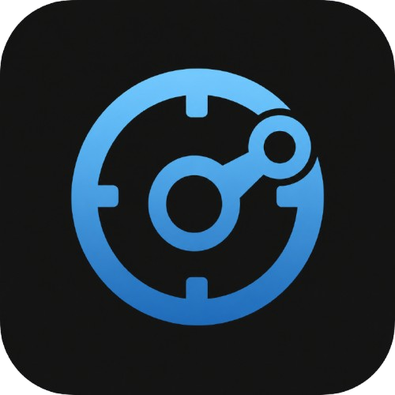
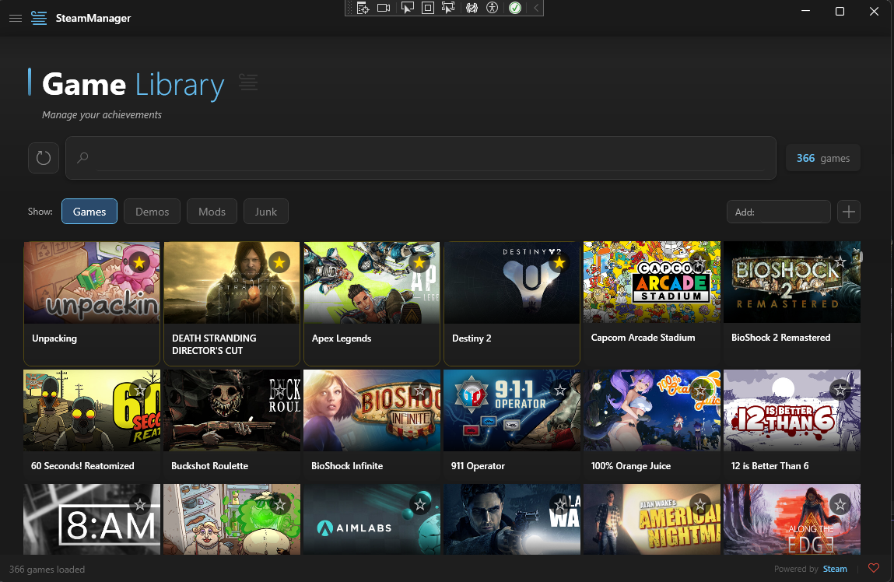
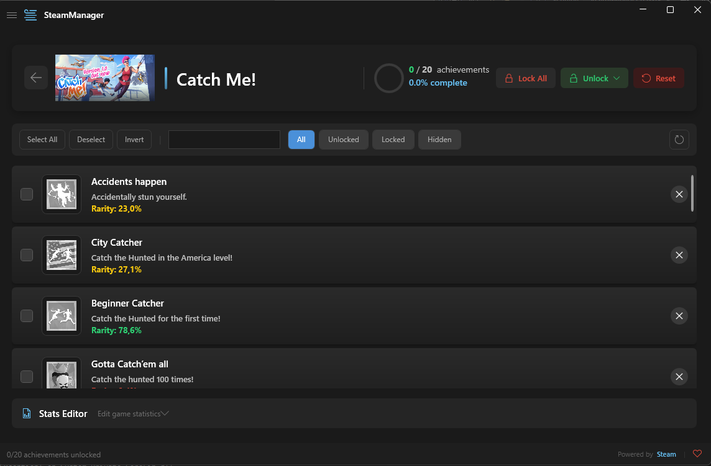

<div align="center">
  <br/>
  
  <br/>
  <h1>SteamManager</h1>
  <p><b>Your Steam Library, Better Browsing</b></p>

  [](LICENSE)
  [](https://dotnet.microsoft.com/download/dotnet/10.0)
  [](https://www.microsoft.com/windows)
  [](https://github.com/lepoco/wpfui)
  [](https://github.com/ZavalaSebas/SteamManager/releases/latest)
  [](https://ko-fi.com/sebastianzavala82573)

  <br/>

  <a href="#screenshots">Screenshots</a> ·
  <a href="#features">Features</a> ·
  <a href="#how-it-works">How It Works</a> ·
  <a href="#get-started">Get Started</a> ·
  <a href="#architecture">Architecture</a>

  <br/><br/>
</div>

---

<table>
<tr>
<td width="60%" valign="top">

A modern Windows companion for your Steam library. Browse games, track achievements with global rarity, organize favorites, and manage everything without fighting the Steam client UI.

Built with **C# / .NET 10** and the same `steamclient.dll` approach used by the original SAM — fully offline-capable, single portable executable.

**No memory injection. No process hooking. No modified files.** Just the official Steamworks API.

</td>
<td width="40%" valign="top">

**⭐ At a glance**

- 📦 **63 MB** single `.exe`
- 🎮 **Full library** browsing
- 🏆 **Achievement** manager
- 📊 **Global rarity** stats
- 🔒 **100% private** — no telemetry
- 🌐 **Website:** [zavalasebas.github.io/SteamManager](https://zavalasebas.github.io/SteamManager/)

</td>
</tr>
</table>

---

<h2 id="screenshots">Screenshots</h2>

<p align="center">
  <b>Main Library</b>&nbsp;&nbsp;·&nbsp;&nbsp;
  <b>Achievement Manager</b>
</p>

<p align="center">
  <a href="docs/assets/screenshot-library.png">
    
  </a>
  &nbsp;&nbsp;
  <a href="docs/assets/screenshot-achievements.png">
    
  </a>
</p>

<br/>

---

<h2 id="features">Features</h2>

<table>
<tr>
<td width="33%" align="center"><b>🎮 Library Browser</b><br/><sub>Browse every game you own with covers, filtered by type. Instant search.</sub></td>
<td width="33%" align="center"><b>🏆 Achievement Manager</b><br/><sub>Full list with global rarity, unlock dates, search, and batch operations.</sub></td>
<td width="33%" align="center"><b>📊 Global Rarity</b><br/><sub>Color-coded unlock percentages from Steam — green/yellow/red.</sub></td>
</tr>
<tr>
<td width="33%" align="center"><b>⭐ Favorites</b><br/><sub>Star your most-played games. Gold accent, always on top.</sub></td>
<td width="33%" align="center"><b>🔍 Smart Filters</b><br/><sub>Filter by games, demos, mods, tools. Toggle chips for quick access.</sub></td>
<td width="33%" align="center"><b>🛡️ Protected Validation</b><br/><sub>Auto-detects developer-protected achievements. Blocks unsafe changes.</sub></td>
</tr>
<tr>
<td width="33%" align="center"><b>⏱️ Smart Unlock</b><br/><sub>Configurable delays between operations. Reduces detection risk.</sub></td>
<td width="33%" align="center"><b>➕ Add by App ID</b><br/><sub>Manually add any owned game by entering its Steam App ID.</sub></td>
<td width="33%" align="center"><b>🔄 Auto-Updater</b><br/><sub>Checks for updates on launch. One-click download &amp; restart.</sub></td>
</tr>
<tr>
<td width="33%" align="center"><b>🌙 Dark Theme</b><br/><sub>Mica backdrop, rounded corners, WPFUI FluentWindow design.</sub></td>
<td width="33%" align="center"><b>📦 Single EXE</b><br/><sub>Self-contained. No runtime, no dependencies, no installation.</sub></td>
<td width="33%" align="center"><b>🖼️ Image Caching</b><br/><sub>Game covers and achievement icons cached locally for speed.</sub></td>
</tr>
</table>

<br/>

---

<h2 id="how-it-works">How It Works</h2>

SteamManager loads `steamclient.dll` from your Steam installation, initializes a session for a specific game, reads all achievement and stat data, and displays it in a modern UI.

```
 ①  Launch SteamManager        →  Steam must be running
 ②  Library loads with covers  →  Cached locally for speed
 ③  Select a game              →  Achievements & stats appear
 ④  Manage achievements        →  Lock, unlock, batch, smart unlock
 ⑤  Changes commit             →  Written via official Steam API
```

---

<h2 id="get-started">Get Started</h2>

<h3>⬇ Download</h3>

Grab the latest release from [GitHub Releases](https://github.com/ZavalaSebas/SteamManager/releases/latest):

```bash
SteamManager.exe    # ~63 MB, self-contained, no .NET required
```

Just run it. No installation, no dependencies.

<h3>🛠 Build from Source</h3>

```bash
git clone https://github.com/ZavalaSebas/SteamManager.git
cd SteamManager
dotnet publish SteamManager/SteamManager.csproj -c Release -r win-x86 --self-contained true -p:PublishSingleFile=true
```

<h3>📋 Requirements</h3>

- **Windows 10 or 11** (x86 — required by Steam's 32-bit DLL)
- **Steam client** running and logged in
- **.NET 10 Runtime** (not needed for self-contained builds)

---

<h2 id="architecture">Architecture</h2>

```
┌──────────────────────────────────────────────────┐
│                  UI (WPF + WPFUI)                │
│  MainWindow  ·  GamePickerView  ·  ManagerView   │
│  ViewModels (MVVM with CommunityToolkit)         │
├──────────────────────────────────────────────────┤
│              Services (Business Logic)           │
│  SmartUnlock  ·  ImageCache  ·  GameLibrary      │
│  ConfigService  ·  Updater  ·  NetworkHelper     │
├──────────────────────────────────────────────────┤
│              Steam API Layer                     │
│  SteamClient  ·  SteamAchievements               │
│  SteamStats   ·  SteamApps  ·  SteamIcons        │
├──────────────────────────────────────────────────┤
│           Native Interop Layer                   │
│  NativeWrapper — vtable extraction               │
│  SteamLoader — DLL loading from registry         │
│  steamclient.dll (from Steam installation)       │
└──────────────────────────────────────────────────┘
```

---

<h2 id="development">Development</h2>

<table>
<tr>
<td width="50%" valign="top">

**📘 [DEVELOPMENT.md](DEVELOPMENT.md)** — workflow rules, test conventions, release process, coding standards, and project structure.

</td>
<td width="50%" valign="top">

**📗 [ARCHITECTURE.md](ARCHITECTURE.md)** — design decisions, ADRs, Steam API integration details, caching system, and known limitations.

</td>
</tr>
</table>

---

<h2 id="support">Support</h2>

<p align="center">
  If you find SteamManager useful, consider supporting the project:
  <br/><br/>
  <a href="https://ko-fi.com/sebastianzavala82573">
    
  </a>
  &nbsp;
  <a href="https://github.com/sponsors/ZavalaSebas?frequency=one-time">
    
  </a>
</p>

---

<div align="center">
  <sub>
    Built with ❤️ by <a href="https://github.com/ZavalaSebas">ZavalaSebas</a>
    ·
    Inspired by <a href="https://github.com/gibbed/SteamAchievementManager">Gibbed's SAM</a>
    ·
    <a href="LICENSE">GPL-3.0</a>
  </sub>
  <br/><br/>
</div>
